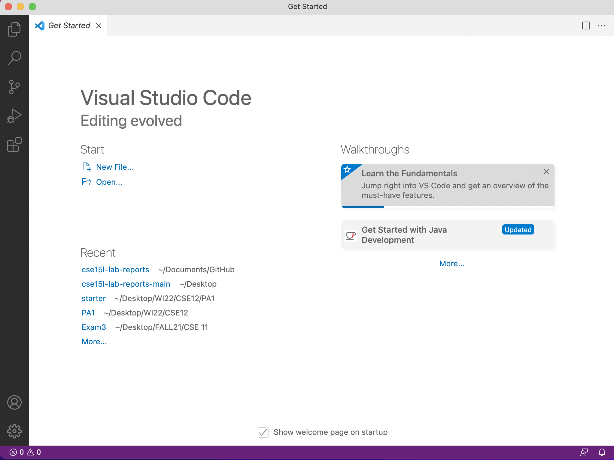
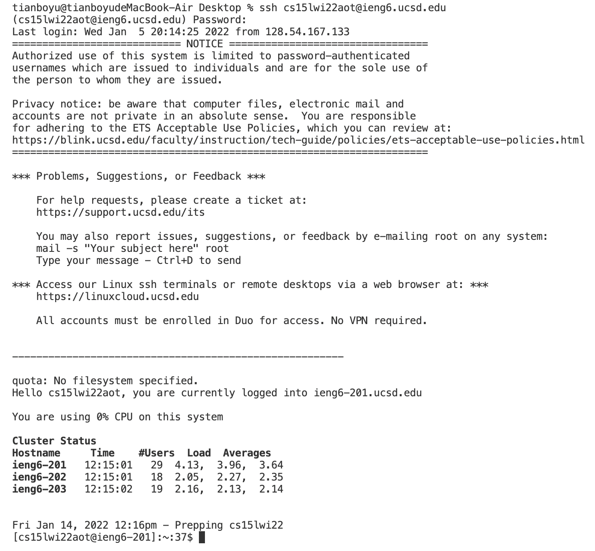
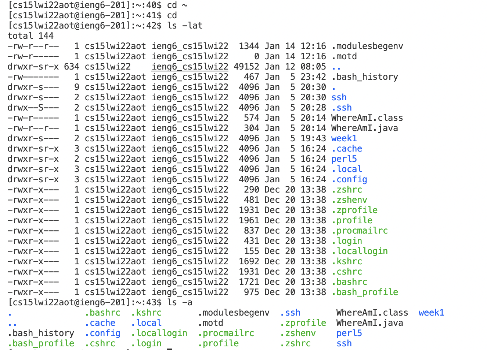
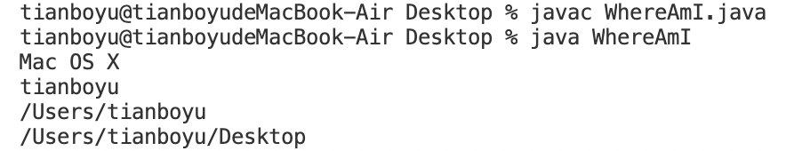
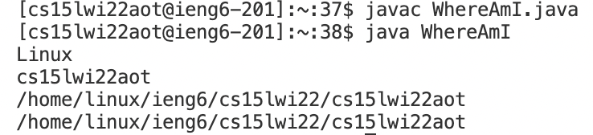
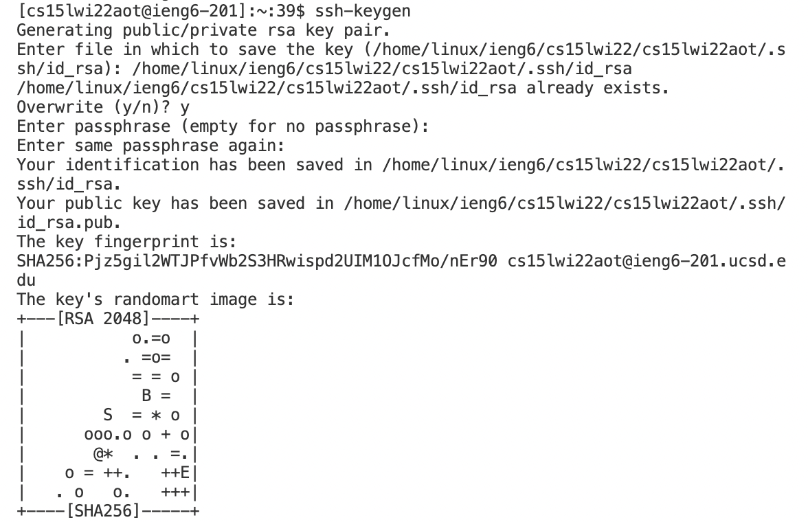

# How to log into course specific account

## Step1: Install Visual Studios Code
download visual studios code from [https://code.visualstudio.com/](https://code.visualstudio.com/) and open it up
 

## Step2: Remotely Connecting
Go to website [https://sdacs.ucsd.edu/~icc/index.php](https://sdacs.ucsd.edu/~icc/index.php) and get you account for CSE15L. 
Activate your account by resetting the password.

Open the terminal on VScode.
Enter ssh cs15lwi22ajn@ieng6.ucsd.edu 
Then input the password as it ask you to do so.
You'll be connected to the server if the password is correct.


## Step3: Run Some Commands
Here are some specific useful commands to try:
```
cd ~
cd
ls -lat
ls -a
ls <directory> where <directory> is /home/linux/ieng6/cs15lwi22/cs15lwi22abc, where the abc is one of the other group members’ username
cp /home/linux/ieng6/cs15lwi22/public/hello.txt ~/
cat /home/linux/ieng6/cs15lwi22/public/hello.txt
```


## Step4: Moving Files over SSH with scp
Create a file on your computer called WhereAmI.java and put the following contents into it:
```
class WhereAmI {
  public static void main(String[] args) {
    System.out.println(System.getProperty("os.name"));
    System.out.println(System.getProperty("user.name"));
    System.out.println(System.getProperty("user.home"));
    System.out.println(System.getProperty("user.dir"));
  }
}
```
Then, after compiling and running the code with `javac` and `java`,
run this command in the terminal from the directory where you made this file:
```
scp WhereAmI.java cs15lwi22zz@ieng6.ucsd.edu:~/
```


## Step5: SSH Keys
Use the `ssh-keygen` command to save the private and public password in two files, which are `id_rsa` and `id_rsa.pub` respectively.
Then use `scp` to copy the public key to the `.ssh` dierctory.
You'll be able to log in to the account on the terminla without the need to enter the password.


## Step 6: Making Remote Running Even More Pleasant
Edit the file and use commands to do whatever you feel comfortable with, such as using semicolons to run multiple commands on the same line in most terminals

