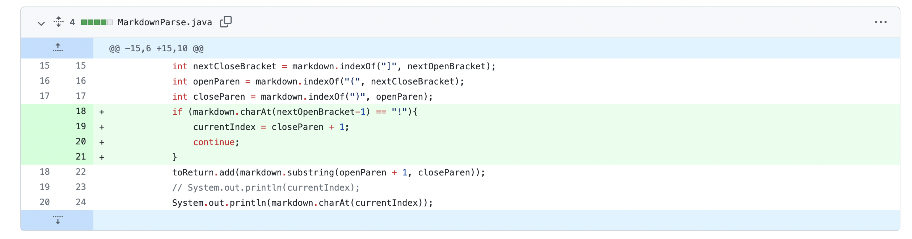
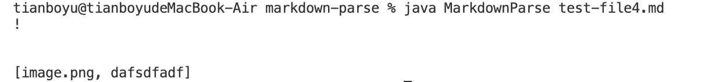
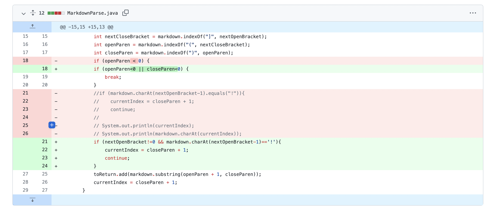
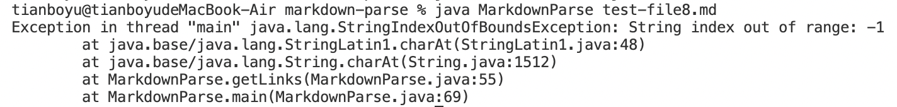
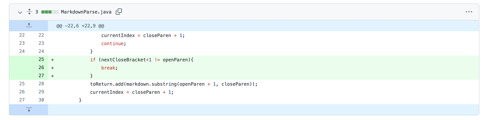
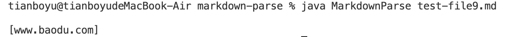

# Week4 Lab Report

## Change 1
Screenshot of the code change diff from Github:

Link to the test file:
[Link](https://github.com/Christby/markdown-parse/blob/main/test-file4.md)

Show the symptom of that failure-inducing input by showing the output of running the file at the command line for the version where it was failing:

The symptom of this failure is that it prints out the image as well, which is not what we want. 
The bug is that the code did not check for the "!" before the open bracket.
The failure inducing input has both the image and link, so it triggers the symptom of printing out the image.

## Change 2
Screenshot of the code change diff from Github:

Link to the test file:
[Link](https://github.com/Christby/markdown-parse/blob/main/test-file8.md)

Show the symptom of that failure-inducing input by showing the output of running the file at the command line for the version where it was failing:

The symptom of this failure is that the index is out of bounds.
The bug is that the index is -1 if the open bracket is the first index, and the code does not check this edge case when nextOpenBracket == 0.  
The failure inducing input has an open bracket in the first index so that it triggers the failure.

## Change 3
Screenshot of the code change diff from Github:

Link to the test file:
[Link](https://github.com/Christby/markdown-parse/blob/main/test-file9.md)

Show the symptom of that failure-inducing input by showing the output of running the file at the command line for the version where it was failing:

The symptom of this failure is that it prints out the link even though the format is wrong. 
The bug is that the code did not check for if there are other things between the close bracket and the open parenthesis. 
The failure inducing input has the wrong format of the link since "jdjdjdj" is inserted before the link.
