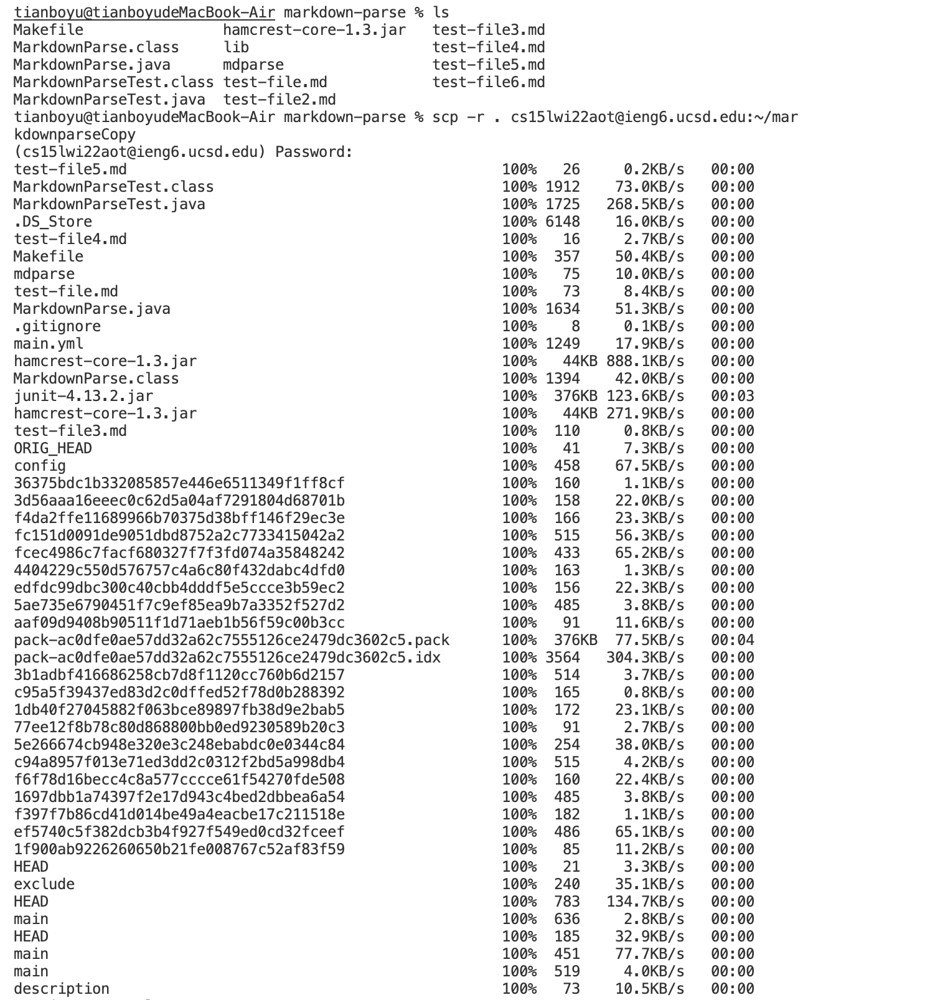
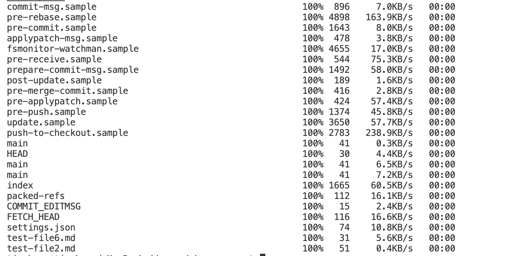
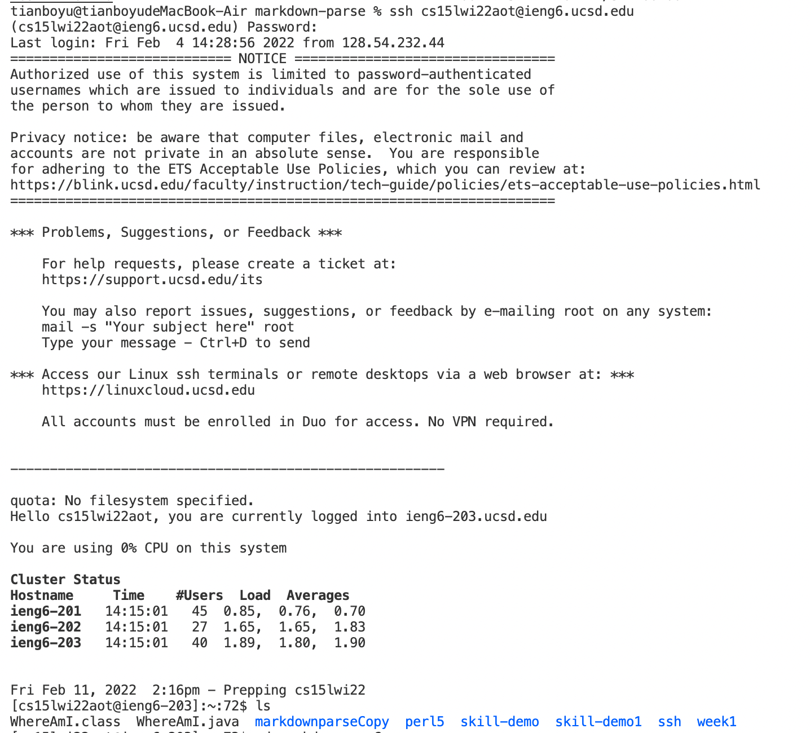
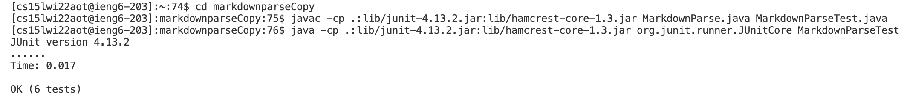
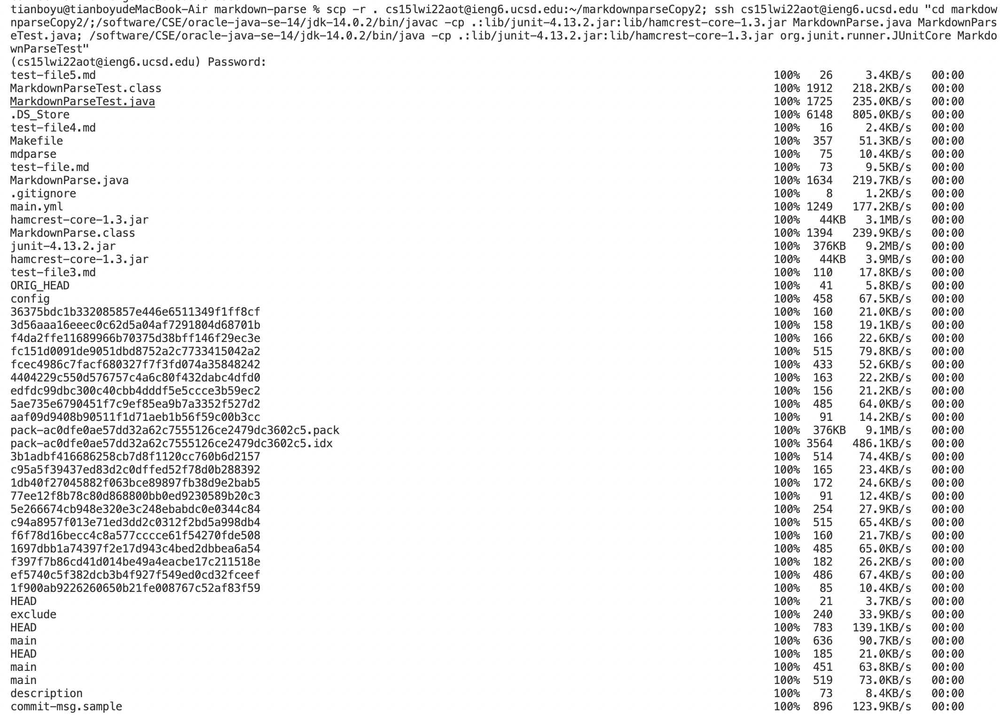
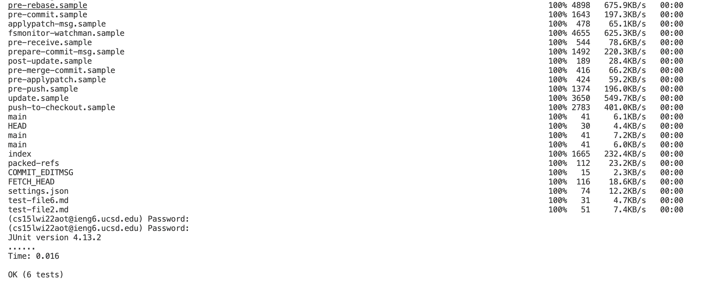

# Week6 Lab Report

## Step 1: Copying the whole markdown-parse directory to the ieng6 account
Use the command `ls` to ckeck all the files in the markdown-parse directory.

Then use the command `scp -r . cs15lwi22aot@ieng6.ucsd.edu:~/markdownparseCopy` to create a markdownparseCopy directory on the server and copy the markdown-parse directory recursively to it. 

## Step 2: Logging into your ieng6 account after doing this and compiling and running the tests for your repository
Log into the ieng6 account by entering the command `ssh cs15lwi22aot@ieng6.ucsd.edu` and change the working directory to markdownparseCopy by entering the command `cd mdcopy`

Then use the command of compiling and running, which are `javac -cp .:lib/junit-4.13.2.jar:lib/hamcrest-core-1.3.jar MarkdownParse.java MarkdownParseTest.java` and `java -cp .:lib/junit-4.13.2.jar:lib/hamcrest-core-1.3.jar org.junit.runner.JUnitCore MarkdownParseTest` to run the JUnit tests on the server. 

## Step 3: Copying the whole directory and run the tests in one line.
Combine the commands in one line, which resulted in the command `scp -r . cs15lwi22aot@ieng6.ucsd.edu:~/markdownparseCopy2; ssh cs15lwi22aot@ieng6.ucsd.edu "cd markdownparseCopy2/;/software/CSE/oracle-java-se-14/jdk-14.0.2/bin/javac -cp .:lib/junit-4.13.2.jar:lib/hamcrest-core-1.3.jar MarkdownParse.java MarkdownParseTest.java; /software/CSE/oracle-java-se-14/jdk-14.0.2/bin/java -cp .:lib/junit-4.13.2.jar:lib/hamcrest-core-1.3.jar org.junit.runner.JUnitCore MarkdownParseTest"`

 This command can copy all the files to the remote server and run the JUnit tests on the server.

