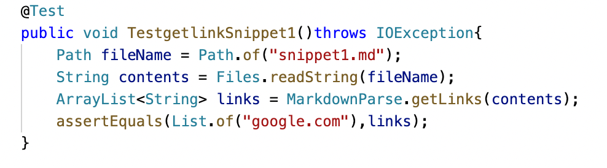
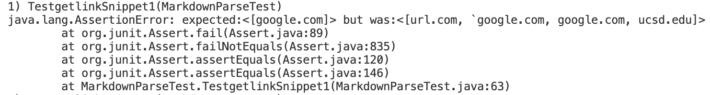
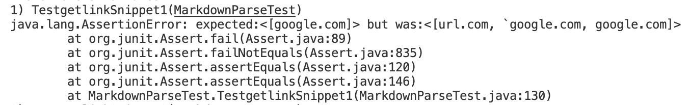
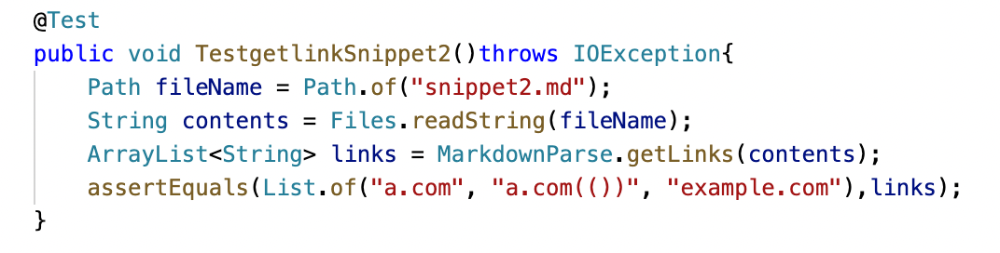
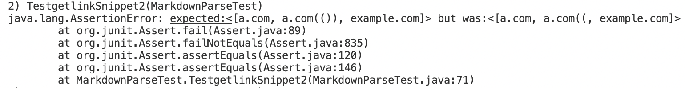
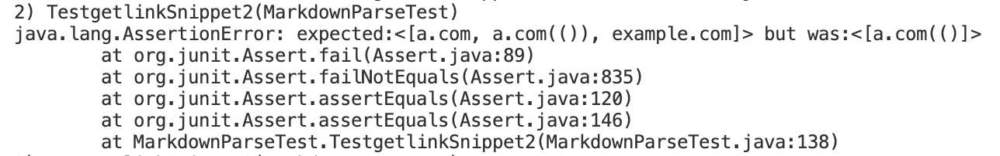
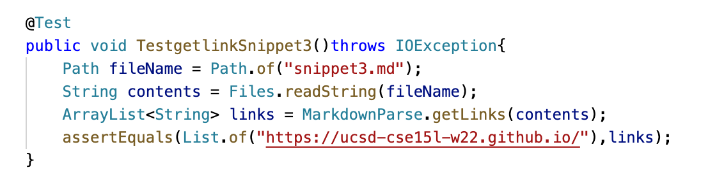
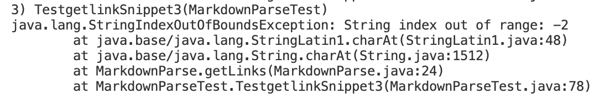
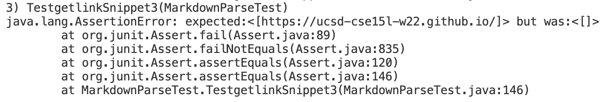

# Week8 Lab Report

Link to my repository: 
[Link](https://github.com/Christby/markdown-parse)
Link to the repository our group reviewed:
[Link](https://github.com/aldrincheung/markdown-parse)

## Snippet 1
test:

result of running the test on my implementation
:
result of running the test on the one I reviewed:

## Snippet 2
test:

result of running the test on my implementation:

result of running the test on the one I reviewed:

## Snippet 3
test:

result of running the test on my implementation:

result of running the test on the one I reviewed:

## Answers to the questions
1. Do you think there is a small (<10 lines) code change that will make your program work for snippet 1 and all related cases that use inline code with backticks?

Yes, I think the code can be correct with a small code change. Some links in snippet 1 should not be returned because there are some backticks between brackets and parenthesis, which makes the link invalid. We should check that there isn't any brackets or other invalid signs between brackets or parenthesis so that the links that doesn't have the correct format would be excluded. 

2. Do you think there is a small (<10 lines) code change that will make your program work for snippet 2 and all related cases that nest parentheses, brackets, and escaped brackets?

Yes, I think the code can be correct with a small code change. The second link in snippet 2 is failed because the nested parenthesis made the code unable to determine the real close parenthesis. To solve this issue, I can add an if statement to check if there are multiple close parenthesis after the open parenthesis and iterate backwords to include the inner parenthesis between the real open and close parenthesis. 

3. Do you think there is a small (<10 lines) code change that will make your program work for snippet 3 and all related cases that have newlines in brackets and parentheses?

No, I don't think the code can be correct with a small code change. Our current code finds the index of open/close brackets/parenthesis and then determine if the link is valid. Since there are lines between the brackets and paranthesis, it is hard to examine and find all the indexes so fixing the code requires a lot more work. 
