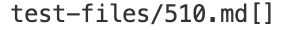
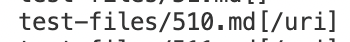
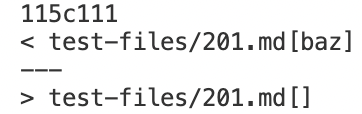

# Week10 Lab Report

## How you found the tests with different results?

Yes. Using the command `diff /home/linux/ieng6/cs15lwi22/cs15lwi22aot/markdown-parse/results.txt /home/linux/ieng6/cs15lwi22/cs15lwi22aot/myMarkdownParse/results.txt` I was able to find the difference in the outputs.

## test 1
Joe's output

Our output

In this case, our implementation is correct and the other implementation is wrong. The reason is that there exists a space between the close bracket and the open parenthesis, which makes the link inside the parenthesis is invalid. 

The bug in Joe's implementation is that the code doesn not check the characters between close bracket and open parenthesis. So the solution to that is to check the spaces between the bracket and parenthesis.

## test 2
Joe's output and our output

In this case, our implementation is correct and the other implementation is wrong. The bug in the Joe's implementation is that it should check if there is some other characters between close bracket and open patenthesis such as the colon here, instead it directly looks for an open parenthesis after the close bracket. 
